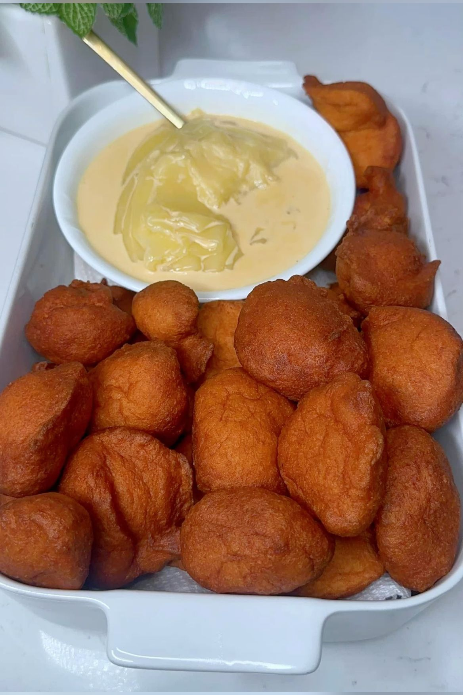
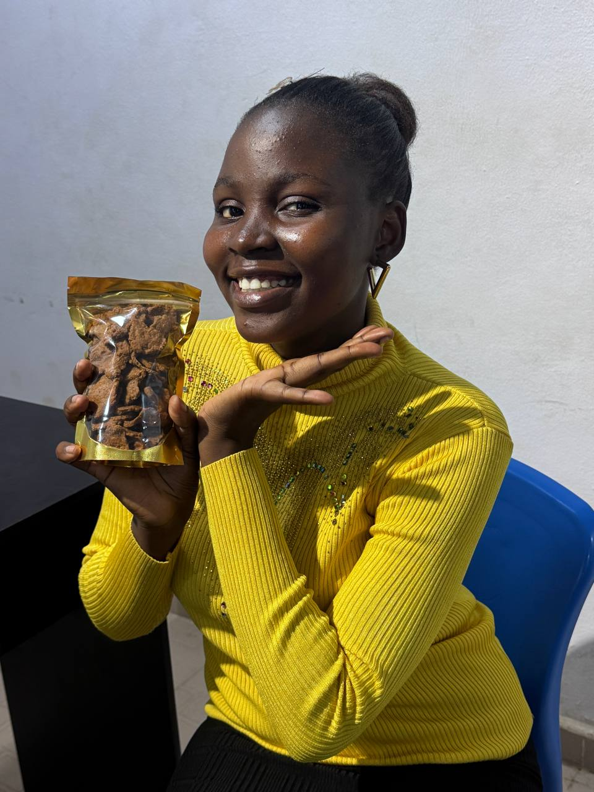
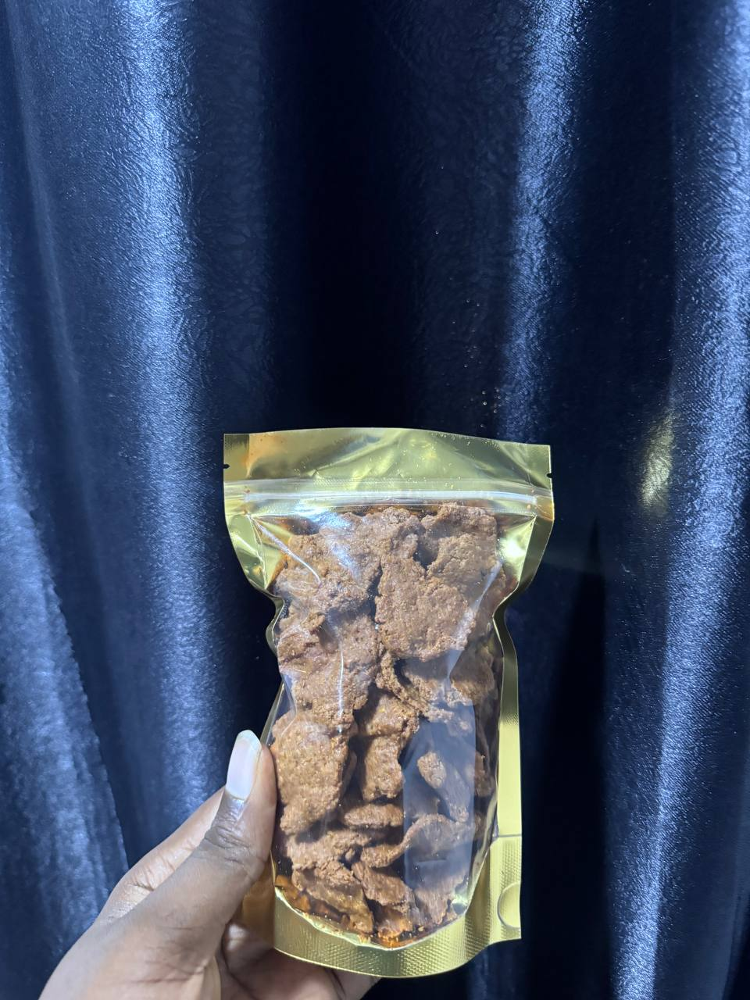

# Web3Nova — akara & kulikuli web studio

> From the frying pan to the front page.

The marketing site for **Web3Nova**, a web studio that builds bold, order-ready
websites for Nigeria's street-food brands — the akara sellers, the kulikuli
makers, the roadside pots turning into real brands. One long, hand-built
landing page: hero, niches, services, gallery, process, testimonials, pricing,
and a WhatsApp-first contact flow.

<p align="center">
  
  
  
</p>

---

## Tech stack

| | |
|---|---|
| **Framework** | [Next.js 16](https://nextjs.org) (App Router) |
| **UI** | React 19 |
| **Styling** | Tailwind CSS v4 (`@tailwindcss/postcss`) |
| **Fonts** | Bricolage Grotesque (display), Geist + Geist Mono — via `next/font` |
| **Images** | `next/image`, served from `public/images` |
| **Hosting** | Vercel (`vercel.json`) |
| **Language** | TypeScript |

> ⚠️ **Heads up:** this repo pins a pre-release of Next.js with breaking changes.
> Before writing code, read the relevant guide in `node_modules/next/dist/docs/`
> and heed deprecation notices — APIs may differ from older Next.js. See
> [`AGENTS.md`](./AGENTS.md).

## Getting started

```bash
npm install
npm run dev
```

Open [http://localhost:3000](http://localhost:3000).

### Scripts

| Command | Does |
|---|---|
| `npm run dev` | Start the dev server |
| `npm run build` | Production build |
| `npm run start` | Serve the production build |
| `npm run lint` | Run ESLint |

## Project structure

```
app/
  layout.tsx     Root layout — fonts, <html>, site metadata
  page.tsx       The entire landing page (all sections + content data)
  globals.css    Design tokens, base styles, ticker animation
public/
  images/        Food & founder photography (see below)
vercel.json      Framework config + long-cache headers for /images and static assets
AGENTS.md        Note about the pinned pre-release Next.js
```

Page content (niches, services, pricing tiers, testimonials, ticker words) lives
as plain data arrays at the top of `app/page.tsx` — edit those to change copy.

## Design system

Defined as CSS custom properties in `app/globals.css`. The palette is pulled
straight from the food:

| Token | Hex | Where it comes from |
|---|---|---|
| `--color-paper` | `#faf2e2` | warm toasted paper (background) |
| `--color-ink` | `#1c1206` | roasted brown-black (text, borders) |
| `--color-palm` | `#e14318` | hot palm-oil red-orange (primary accent) |
| `--color-gold` | `#f4a52a` | fried-akara gold |
| `--color-nut` | `#7a3b1e` | groundnut / kulikuli brown |
| `--color-leaf` | `#1f5a39` | plantain-leaf green |

The look is a neo-brutalist print style: 2px ink borders, hard offset
(`box-shadow`) blocks, a scrolling marquee ticker, and rotated "stamp" labels.

## Imagery

All photography lives in `public/images/` and is referenced via `next/image`.
Vercel serves it with a one-year immutable cache (`vercel.json`).

| File | Used in |
|---|---|
| `hero.jpg` | Hero pinned product + akara niche lead |
| `kulikuli-owner.jpg` | Hero portrait + kulikuli niche lead |
| `kulikuli-gold-pack.jpg`, `kulikuli-floral-pack.jpg` | Kulikuli niche + gallery |
| `frying-1.jpg`, `frying-2.jpg`, `batter.jpg` | Akara niche + gallery |
| `akara-bread.jpg`, `akara-plate-1.jpg`, `akara-plate-2.jpg` | Niche + gallery |
| `chips-bowl.jpg`, `chips-cup.jpg`, `packaged.jpg` | Gallery / products |

To swap a photo, drop a new file into `public/images/` and update the matching
`src` in `app/page.tsx`. Keep alt text descriptive — it ships in the markup.

## Deploying

Configured for [Vercel](https://vercel.com). Push the repo and import it, or:

```bash
npm i -g vercel
vercel        # preview
vercel --prod # production
```

## Contact

Web3Nova builds the sites — reach the studio at:

- **WhatsApp / phone:** [0704 331 4162](https://wa.me/2347043314162)
- **Email:** [bernard@web3nova.org](mailto:bernard@web3nova.org)
- **Instagram:** [@web3_nova](https://www.instagram.com/web3_nova/)
- **X:** [@web3_nova](https://x.com/web3_nova)
- **TikTok:** [web3_nova](https://vm.tiktok.com/ZS96C7GskB8eP-qS5aQ/)

---

<sub>© Web3Nova · Made in Naija 🇳🇬</sub>
